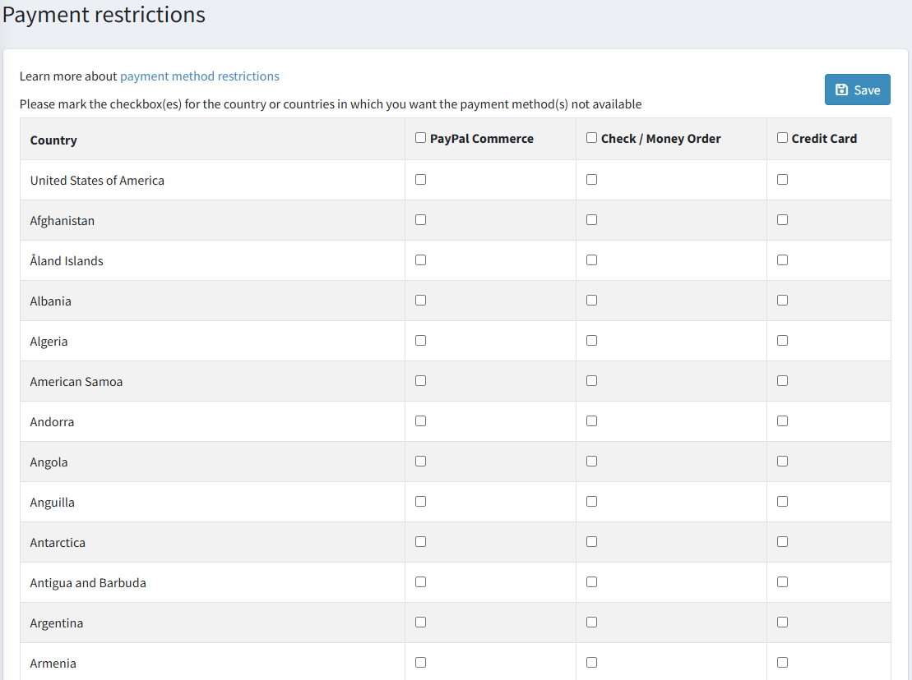

# 付款方式限制

付款方式限制功能讓您可以針對來自特定國家的訂單限制其可使用的付款方式。

若要限制付款方式，請前往 **設定 (Configuration) → 付款限制 (Payment restrictions)**。

勾選您希望該付款方式無法使用的國家或地區對應的核取方塊。

點擊 **儲存 (Save)**。

> [!NOTE]
>
> 如有需要，您可以選取整個欄位，以對所有國家套用限制。