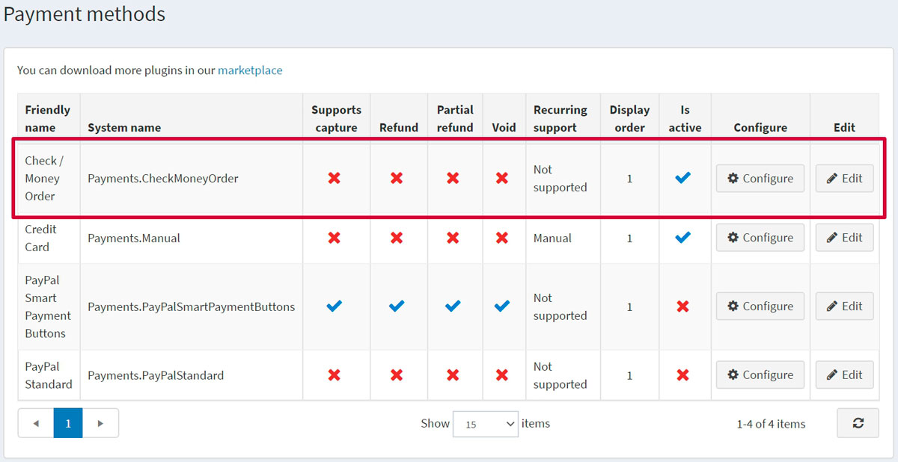
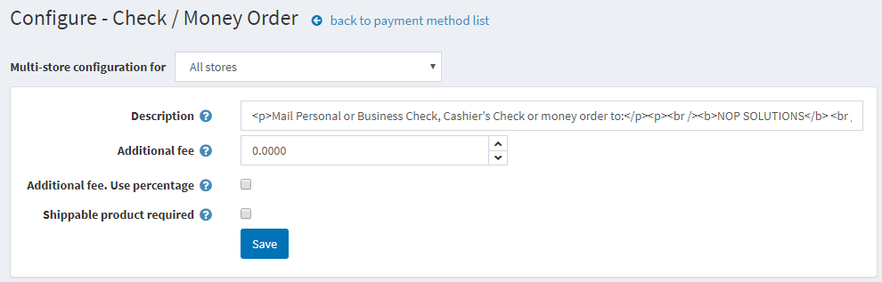
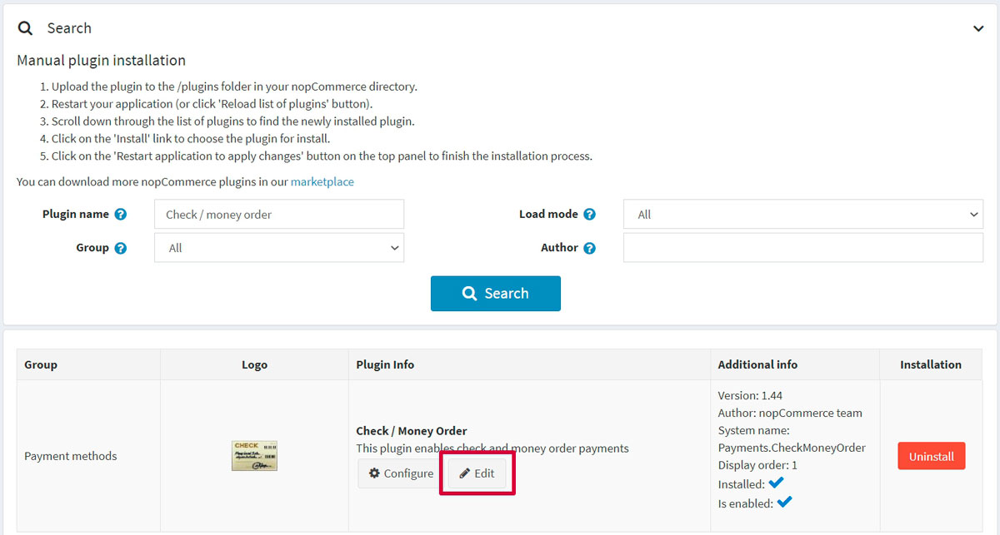
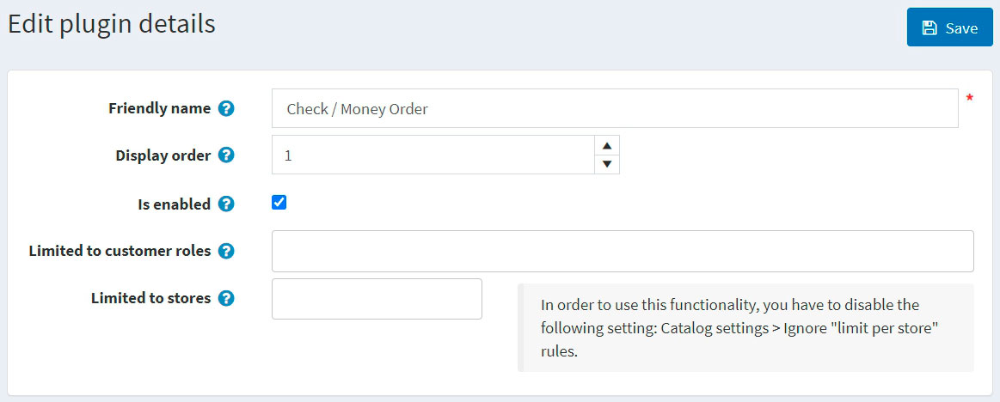

# 支票/匯票

支票/匯票通常被政府機構或大型企業所使用。顧客並非直接透過您的網站進行支付，而是要求您發送**採購訂單 (Purchase order, PO)**，隨後再將款項寄回給您。大部分的訂單處理程序皆在軟體外部進行。

若要設定此付款方式，請前往 **設定 → 付款方式**。找到 **支票/匯票 (Payments.CheckMoneyOrder)** 付款方式列表：

## 啟用該方式、編輯名稱與顯示順序

您可以編輯付款方式名稱（將顯示於前台網站供顧客查看）或其顯示順序。若要執行此操作，請點擊付款方式列表頁面中該外掛列的 **編輯** 按鈕。您可以輸入 **友善名稱** 與 **顯示順序**。在此列中，您還可以透過 **已啟用** 欄位來啟用或停用此外掛。點擊 **更新** 按鈕，您的變更即會儲存。

## 設定付款方式

在 **設定 → 付款方式** 頁面上，找到 **支票/匯票 (Payments.CheckMoneyOrder)** 付款方式並點擊 **設定** 按鈕。系統將顯示如下的 *設定 - 支票/匯票* 視窗：

請依照下列說明設定此付款方式：

* 在 **說明** 欄位中，輸入結帳時會顯示給顧客的資訊。
* 定義使用此方式的 **額外費用**。
* 在 **額外費用（百分比）** 欄位中，定義是否對訂單總額收取額外的百分比費用。若未啟用，則使用固定金額。
* **需要可配送商品** 欄位用於指示結帳時是否必須包含可配送的商品，才會顯示此付款方式。

點擊 **儲存**。

## 限制商店與顧客角色

您可以將任何付款方式限制在特定商店或顧客角色。這意味著該付款方式僅適用於特定的商店或顧客角色。您可以從 *外掛列表* 頁面進行此設定。

1. 前往 **設定 → 本地外掛**。找到您想要限制的外掛。在我們的案例中，即為 **支票/匯票**。為了加快搜尋速度，請使用頁面頂部的 *搜尋* 面板，並透過 *付款方式* 選項，按 **外掛名稱** 或 **群組** 進行搜尋。

   

1. 點擊 **編輯** 按鈕，系統將顯示如下的 *編輯外掛詳細資訊* 視窗：

   

1. 您可以設定以下限制：

   * 在 **限制於顧客角色** 欄位中，選擇一個或多個顧客角色（例如管理員、供應商、訪客），這些角色將能夠使用此外掛。如果您不需要此選項，請將此欄位留空。

      > [!Important]
      > 若要使用此功能，您必須停用以下設定：**商品目錄設定 → 忽略 ACL 規則（全站）**。閱讀更多關於權限控制（Access Control List）的資訊 [here](xref:zh-Hant/running-your-store/customer-management/access-control-list)。

   * 使用 **限制於商店** 選項將此外掛限制在特定商店。如果您有多商店，請從列表中選擇一個或多個。如果您不需要此選項，請將此欄位留空。

      > [!Important]
      > 若要使用此功能，您必須停用以下設定：**商品目錄設定 → 忽略「限制於特定商店」規則（全站）**。閱讀更多關於多商店功能的資訊 [here](xref:zh-Hant/getting-started/advanced-configuration/multi-store)。

點擊 **儲存**。