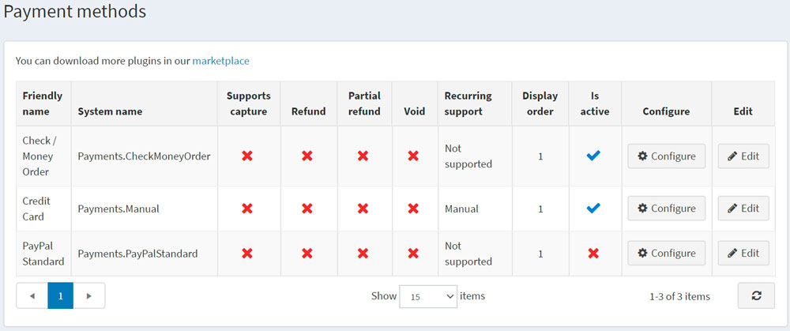

# 付款方式

付款方式是指顧客支付訂單款項的途徑。nopCommerce 同時支援*線上*與*線下交易*。對於線上付款方式，nopCommerce 與第三方付款提供程序整合，以便在訂單完成時，將顧客的信用卡資訊自動傳送至該提供程序（進行授權，或授權並扣款）。您可以同時啟用多種付款方式。顧客可以在結帳時選擇他們想要採用的付款方式。

若要定義付款方式，請前往 **設定 → 付款方式**。

> [!TIP]
>
> 預設情況下，nopCommerce 提供多種付款方式，但您可以在 nopCommerce [市集](https://www.nopcommerce.com/marketplace) 中找到更多付款外掛。

關於付款方式的開發細節，請參閱此 [文件](xref:zh-Hant/developer/plugins/payment-method)。

若要啟用付款方式，請點擊所需方法旁邊的 **編輯**，勾選 **已啟用** 核取方塊，然後點擊 **更新**。**已啟用** 選項將會從 *false* 變更為 *true*。

不同的付款方式支援不同的選項。付款方式可能會支援（或不支援）以下 **4 種付款功能**：

* **支援請款 (Supports capture)**：表示此方法是否允許在金額扣款後處理資金轉帳。
* **退款 (Refund)**：表示此方法允許在金額扣款並請款後進行退款。
* **部分退款 (Partial refund)**：表示此方法是否允許在金額扣款並請款後進行部分退款。
* **取消授權 (Void)**：表示此方法允許在金額扣款前（當付款狀態為待處理時）進行退款。
* **支援定期購 (Recurring support)**：表示此方法是否允許定期購付款。

點擊付款方式旁邊的 **設定** 即可進行相關設定。

## 參閱

* [PayPal Commerce](xref:zh-Hant/getting-started/configure-payments/payment-methods/paypal-commerce)
* [PayPal Zettle](xref:zh-Hant/getting-started/configure-payments/payment-methods/paypal-zettle)
* [PayPal Standard](xref:zh-Hant/getting-started/configure-payments/payment-methods/paypal-standard)
* [PayPal Smart Payment Buttons](xref:zh-Hant/getting-started/configure-payments/payment-methods/paypal-smart-payment-buttons)
* [支票/匯票](xref:zh-Hant/getting-started/configure-payments/payment-methods/check-money-order)
* [信用卡 (人工處理)](xref:zh-Hant/getting-started/configure-payments/payment-methods/credit-card-manual-processing)