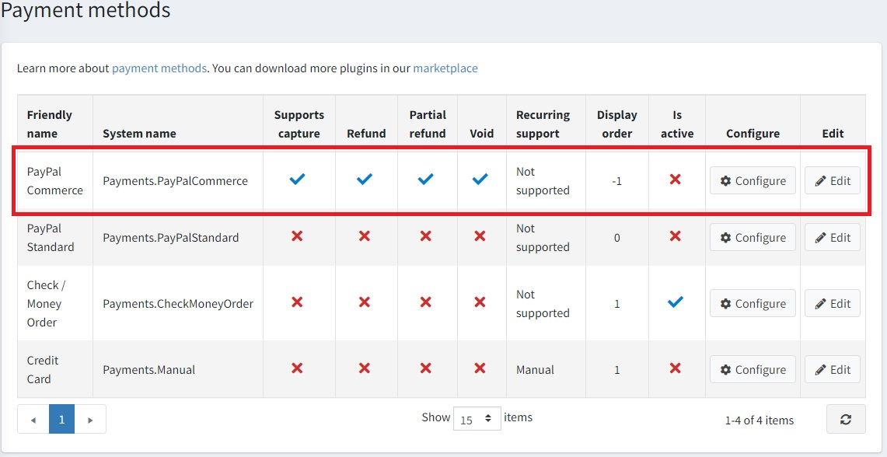
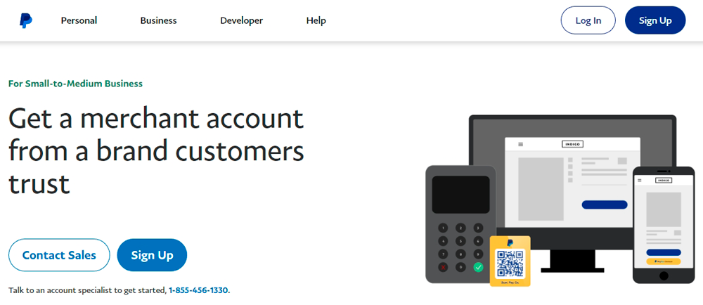
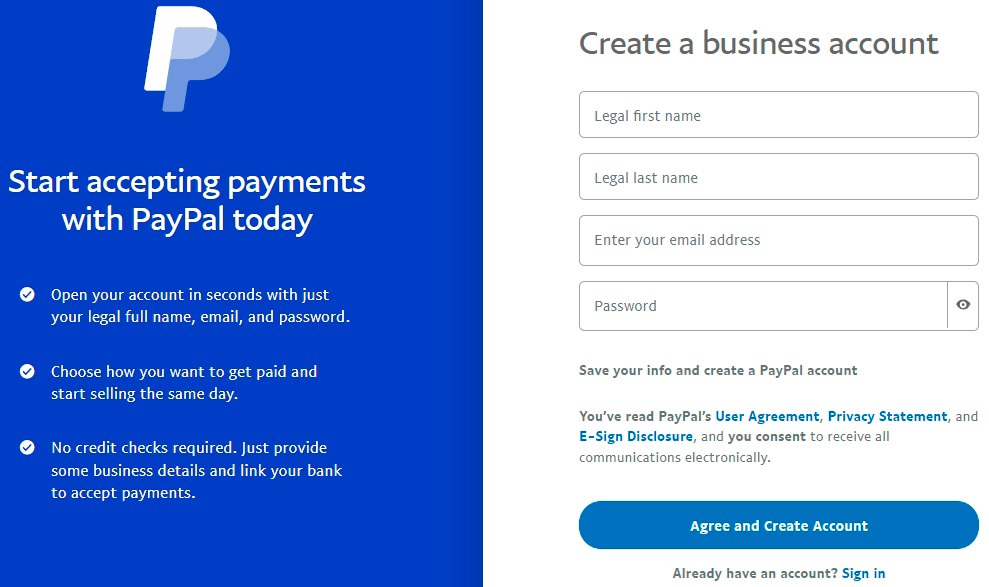
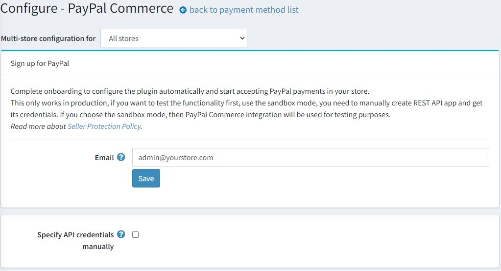
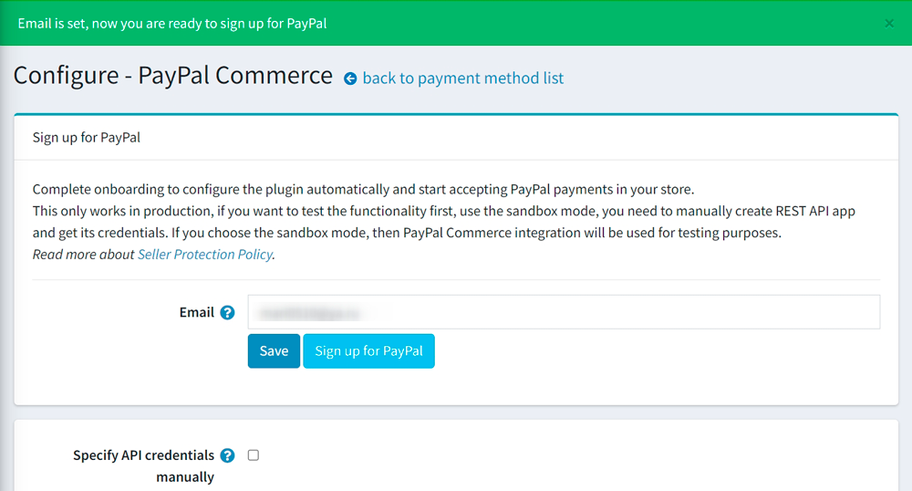
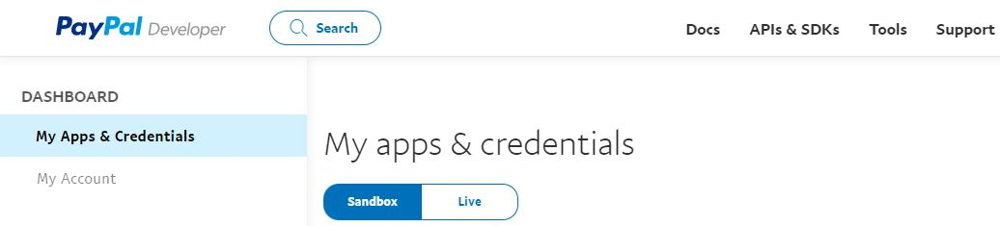
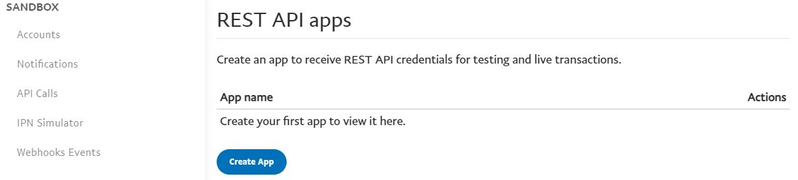
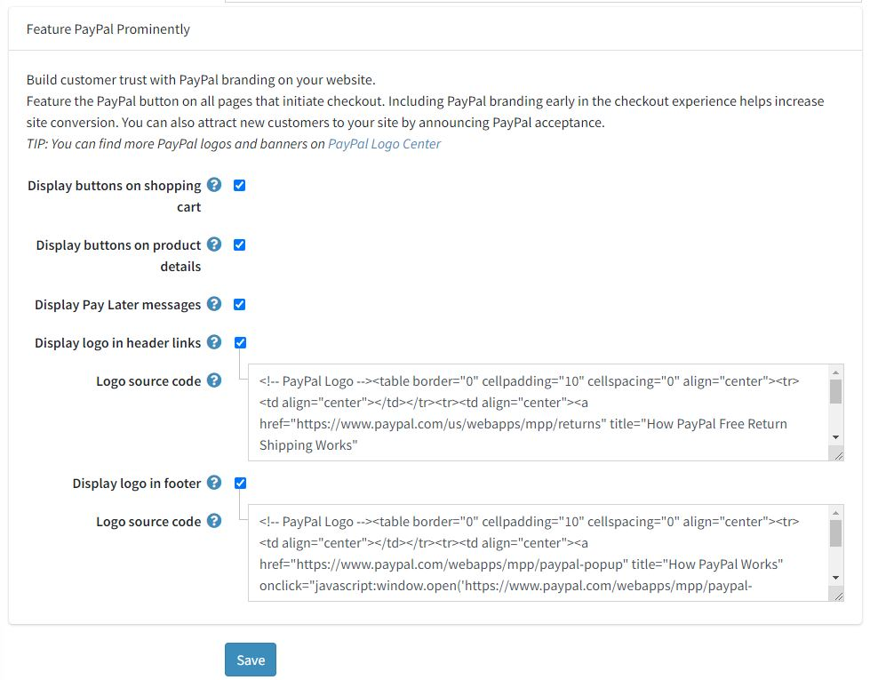
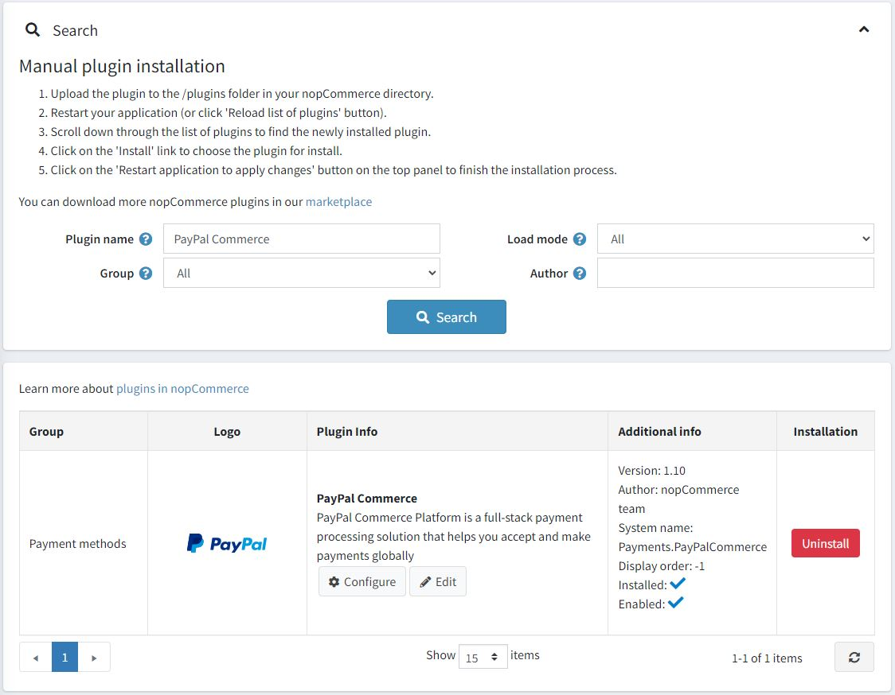
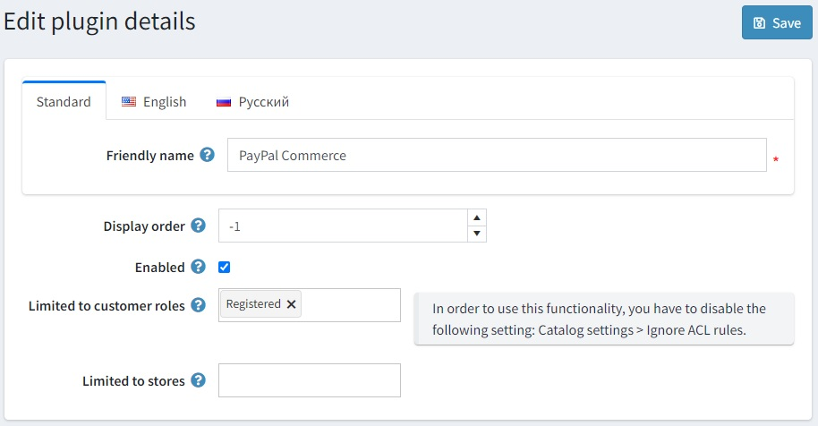

> [!NOTE]
>
> 本說明文件頁面描述的是舊版本的外掛（4.70.10 之前）。您可以在[此頁面](xref:zh-Hant/getting-started/configure-payments/payment-methods/paypal-commerce)找到目前的說明文件。

# PayPal Commerce

`PayPal Commerce` 為您的買家提供簡化且安全的結帳體驗。PayPal 會自動聰明地向您的購物者呈現最相關的付款類型，讓他們能更輕鬆地使用 Pay with Venmo、PayPal Credit、信用卡付款、iDEAL、Bancontact、Sofort 以及其他付款方式來完成購買。

## 設定付款方式

若要設定 `PayPal Commerce` 外掛，請前往 **設定 → 付款方式**。接著在付款方式列表中找到 **PayPal Commerce** 付款方式：

請按照以下步驟設定 `PayPal Commerce`：

### 1. 啟用付款提供程序

若要執行此操作，請在付款方式清單頁面中，點擊該外掛資料列上的 **編輯** 按鈕。勾選 **啟用** 核取方塊以啟用該外掛，接著點擊 **更新** 按鈕，您的變更即會儲存。

### 2. 建立 PayPal 帳戶

如果您已經擁有 PayPal 帳戶，請直接前往[下一節](#3-set-up-the-paypal-developer-dashboard)。如果您還沒有帳戶，請註冊一個「商業帳戶」。您有兩種方式可以執行此操作：您可以在 PayPal 網站上註冊帳戶，或者直接從外掛設定頁面進行註冊。讓我們簡單說明這兩種方式：

#### 在 PayPal 網站上註冊帳戶

1. 前往 [PayPal](https://www.paypal.com/us/webapps/mpp/referral/paypal-business-account2?partner_id=9JJPJNNPQ7PZ8) 註冊商業帳戶。只需點擊該頁面上的 **Sign up**（註冊）按鈕：

    
1. 接著填寫關於您個人及業務的相關資訊：

    

> [!NOTE]
>
> 如果您已經擁有帳戶，系統將會將您重新導向至授權頁面。

#### 從外掛設定頁面註冊帳戶

1. 在後台管理中開啟 PayPal Commerce 設定頁面。您將會看到以下表單：

    

1. 輸入您的電子郵件地址，並點擊 **Save**（儲存）按鈕，讓 PayPal 進行檢查。

1. 如果一切正常，您將會看到以下綠色通知，以及一個新增的 **Sign up for PayPal**（註冊 PayPal）按鈕：

    

1. 點擊此按鈕，您將會看到一個彈出式視窗，讓您可以填寫部分資料並註冊帳戶：

    

    您需要完成幾個步驟來填寫所有必要的資料。最後一個步驟會要求您確認電子郵件以啟用您的帳戶。

### 3. 設定 Paypal 開發者後台

1. 使用您的 PayPal 帳號憑證登入 [開發者後台](https://developer.paypal.com/developer/applications?partner_id=9JJPJNNPQ7PZ8)。

1. 在 **My Apps & Credentials** 中，使用切換開關在正式環境（live）與沙盒測試環境（sandbox）應用程式之間進行切換。
    
  
1. 導覽至 *REST API apps* 區段並點擊 **Create App**。
    

1. 輸入您的應用程式名稱並點擊 **Create App**。應用程式詳細資料頁面將會開啟並顯示您的憑證。

1. 複製並儲存您應用程式的 **Client ID** 與 **Secret**。

1. 檢查您的應用程式詳細資料，若有任何變更，請務必儲存。

### 4. 在 nopCommerce 中設定付款方式

1. 在 **設定 → 付款方式** 頁面中找到 **PayPal Commerce** 付款方式，然後點擊 **設定**。隨後將會顯示 *設定 - PayPal Commerce* 頁面，如下所示：
    

1. 在 *設定 - PayPal Commerce* 頁面上定義以下設定：
    * **手動指定 API 憑證 (Specify API credentials manually)** - 決定是否需要手動設定憑證。如果您已經建立過應用程式，或者想要使用沙盒 (sandbox) 模式，請選擇此選項。否則，外掛將會自動進行設定，您在完成 PayPal 註冊後，即可開始在商店中接受 PayPal 付款。

        

    * **使用沙盒 (Use sandbox)**：如果您想先測試此付款方式，請勾選此項。
    * 輸入您在先前步驟中儲存的 **用戶端 ID (Client ID)**。
    * 輸入您在先前步驟中儲存的 **密鑰 (Secret)**。
    * 選擇 **付款類型 (Payment type)**，可設定為立即請款 (capture)，或在建立訂單後進行授權 (authorize)。

1. 接著前往 *PayPal Prominently* 面板：
    
  
    在此面板上定義顯示設定：

      * 勾選 **在購物車顯示按鈕 (Display buttons on shopping cart)** 核取方塊，以便在購物車頁面顯示 PayPal 按鈕，取代預設的結帳按鈕。

      * 勾選 **在商品詳細頁顯示按鈕 (Display buttons on product details)**，以便在商品詳細頁面顯示 PayPal 按鈕；點擊這些按鈕的效果與預設的「加入購物車」按鈕行為一致。

      * 勾選 **顯示「稍後付款」訊息 (Display Pay Later messages)** 方塊，以利用網站上的「稍後付款」訊息功能。該訊息會顯示在商品頁面與結帳頁面上，顯示顧客需分四期支付的金額。

        

      * 勾選 **在頁首連結顯示標誌 (Display logo in header links)** 核取方塊，以便在頁首連結中顯示 PayPal 標誌。這些標誌和橫幅是向買家說明您選擇 PayPal 來安全處理付款的絕佳方式。
        * 若勾選上述核取方塊，將會顯示 **標誌原始碼 (Logo source code)** 欄位。請在此欄位輸入標誌的原始碼。您可以在 PayPal 標誌中心 (PayPal Logo Center) 找到更多標誌和橫幅。您也可以修改程式碼，使其能妥善契合您的佈景主題與網站風格。

      * 勾選 **在頁尾顯示標誌 (Display logo in footer)** 核取方塊，以便在頁尾顯示 PayPal 標誌。這些標誌和橫幅是向買家說明您選擇 PayPal 來安全處理付款的絕佳方式。
        * 若勾選上述核取方塊，將會顯示 **標誌原始碼 (Logo source code)** 欄位。請在此欄位輸入標誌的原始碼。您可以在 PayPal 標誌中心 (PayPal Logo Center) 找到更多標誌和橫幅。您也可以修改程式碼，使其能妥善契合您的佈景主題與網站風格。

點擊 **儲存** 以儲存外掛設定。

## 限制商店與顧客角色

您可以將任何付款方式限制在特定商店與顧客角色中使用。這代表該付款方式將僅對特定的商店或顧客角色開放。您可以在*外掛清單*頁面中進行此設定。

1. 前往 **設定 → 本地外掛**。找到您想要限制的外掛。在本範例中，它是 **PayPal Commerce**。若要更快找到它，請使用頁面頂端的*搜尋*面板，透過 **外掛名稱** 或使用*付款方式*選項來搜尋 **群組**。

    

1. 點擊 **編輯** 按鈕，系統將顯示如下的 *編輯外掛詳細資訊* 視窗：

    

1. 您可以設定以下限制：

    * 在 **限制顧客角色** 欄位中，選擇一個或多個顧客角色（例如管理員、供應商、訪客），這些角色將能夠使用此外掛。如果您不需要此選項，只需將此欄位留空即可。

        > [!Important]
        > 為了使用此功能，您必須停用以下設定：**商品目錄設定 → 忽略權限控制規則（全站）**。閱讀更多關於權限控制（ACL）的資訊 [here](xref:zh-Hant/running-your-store/customer-management/access-control-list)。

    * 使用 **限制商店** 選項將此外掛限制在特定商店使用。如果您有多個商店，請從清單中選擇一個或多個。如果您不使用此選項，只需將此欄位留空即可。

        > [!Important]
        > 為了使用此功能，您必須停用以下設定：**商品目錄設定 → 忽略「依商店限制」規則（全站）**。閱讀更多關於多商店功能的資訊 [here](xref:zh-Hant/getting-started/advanced-configuration/multi-store)。

    點擊 **儲存**。