# PayPal Commerce

`PayPal Commerce` 為您的買家提供簡化且安全的結帳體驗。PayPal 會自動向您的購物者智能呈現最相關的付款方式，讓他們能夠更輕鬆地使用信用卡付款、Apple Pay、Google Pay、PayPal Credit、Venmo、iDEAL、Bancontact 以及其他付款方式來完成購買。

## 設定付款方式

若要設定 `PayPal Commerce` 外掛，請前往 **組態 → 付款方式**。接著在此頁面中找到 **PayPal** 付款方式。由於這是我們推薦的付款方式，因此您將能輕鬆找到它。

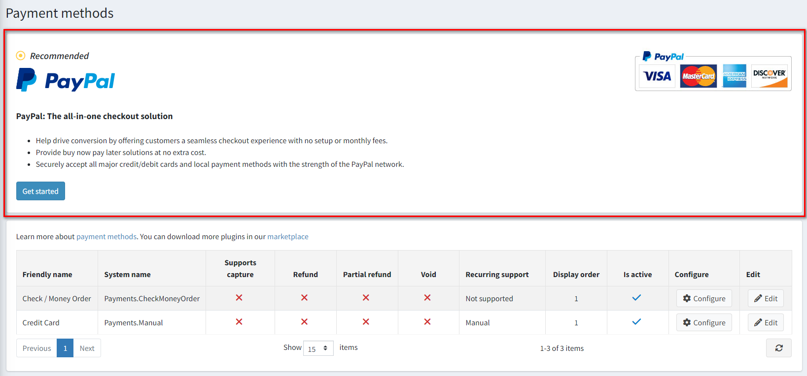

此外，您也可以透過導覽選單存取外掛組態。

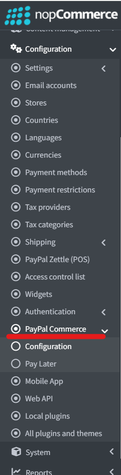

請按照下列步驟設定 `PayPal Commerce`：

### 1. 連接 PayPal 帳戶

無論您是否已經擁有 PayPal 商業帳戶、僅擁有個人帳戶，還是尚未擁有任何帳戶，連接流程都是以相同方式開始的：

1. 開啟後台管理中的 PayPal Commerce 設定頁面。您將會看到以下表單：

    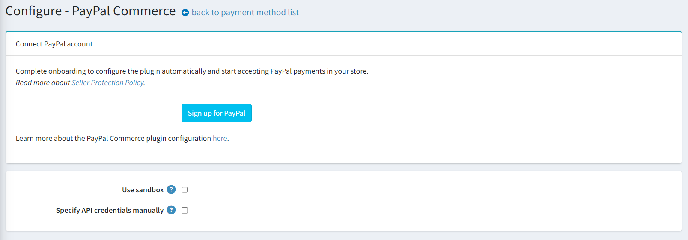

1. 選擇您要連接的帳戶類型，即正式環境（production）或沙盒環境（sandbox）。如果您想先測試該外掛，請啟用 **Use sandbox**（使用沙盒）設定。

1. 點擊 **Sign up for PayPal**（註冊 PayPal）按鈕，您將會看到下方的彈出視窗，允許您填寫資料並連接帳戶：

    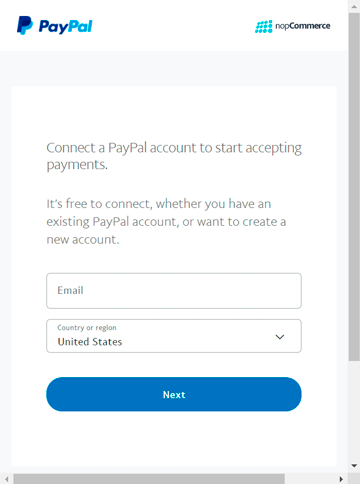

    您需要完成幾個步驟來填寫所有必要的詳細資訊，所需的詳細資訊數量會根據您是建立新帳戶、連接現有帳戶，還是將個人帳戶轉換為商業帳戶而有所不同。

1. 一旦您完成程序並獲准使用 PayPal 付款，請回到外掛設定頁面並重新整理。您將會看到以下表單：

    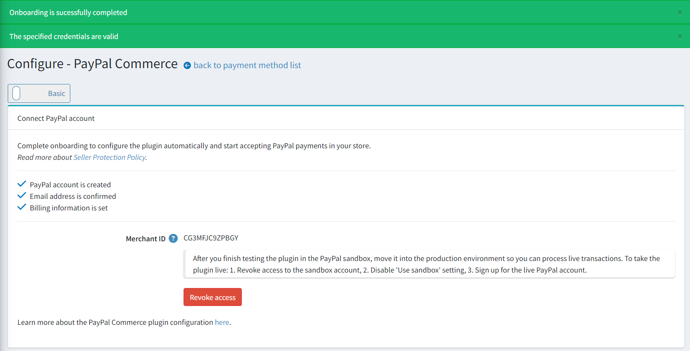

   在此您將看到關於成功連接的通知；如果有任何警告或錯誤，請參考 **System → Log**（系統 → 日誌）以了解更多詳細資訊。

   同時也會顯示帳戶連接程序的狀態，如果有任何步驟尚未完成，請登入您的 PayPal 個人帳戶並完成該步驟。

   如果您連接的是沙盒帳戶，也會顯示提醒，告知您在完成測試後需要建立正式帳戶。

1. 如果您在 PayPal 帳戶中已經建立了 REST API 應用程式並希望繼續使用它，您應該勾選 **Specify API credentials manually**（手動指定 API 憑證）核取方塊，並在下方的欄位中指定憑證，如下所示：

    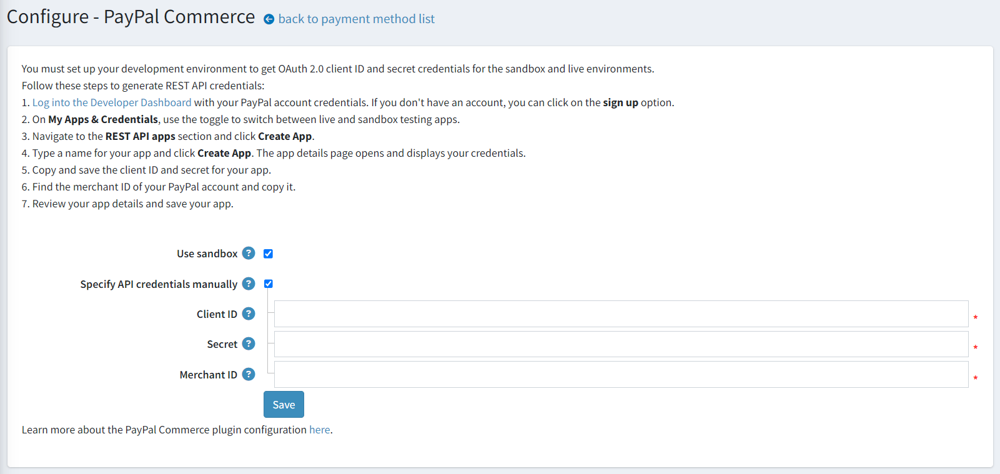

### 2. 設定外掛

1. 在 **設定 → 付款方式** 頁面中找到 **PayPal Commerce** 付款方式並點擊 **設定**，您將會看到以下設定區塊：

    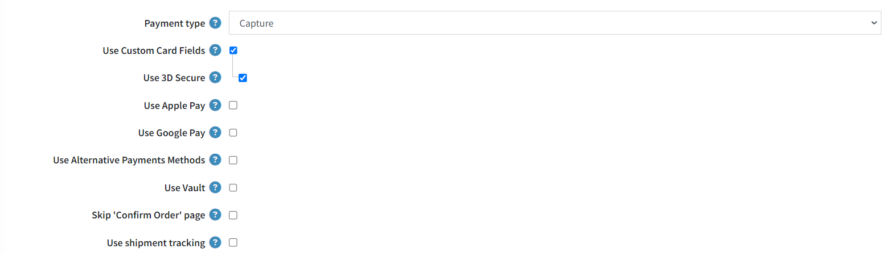

    * 選擇 **付款類型 (Payment type)**，以決定是要立即請款，還是在訂單建立後先進行授權。
    * 勾選 **使用自訂卡片欄位 (Use Custom Card Fields)** 以在您的商店中啟用進階信用卡與簽帳金融卡付款功能。這是一項符合 PCI 標準的解決方案，可讓顧客直接在您的商店內輸入簽帳金融卡與信用卡資訊進行付款，無需導向至第三方網站。
    * 勾選 **使用 Apple Pay (Use Apple Pay)** 以在您的商店中啟用 Apple Pay。在沙盒（sandbox）或正式環境開始使用前，請驗證環境中會顯示 Apple Pay 按鈕的所有網域名稱。Apple Pay 交易僅適用於註冊給您的網域與網站。

        1. [下載](https://paypalobjects.com/devdoc/apple-pay/well-known/apple-developer-merchantid-domain-association) 您環境的網域關聯檔案。
        1. 將該檔案託管在您想要註冊的每個網域與子網域的 */.well-known/apple-developer-merchantid-domain-association* 路徑下。
        1. 登入 PayPal 商家帳戶，前往 **付款方式**，在 **Apple Pay** 區塊中選擇 **管理** 連結，然後在那裡 **新增網域**。

    * 勾選 **使用 Google Pay (Use Google Pay)** 以在您的商店中啟用 Google Pay。
    * 勾選 **使用替代付款方式 (Use Alternative Payments Methods)** 以在您的商店中啟用替代付款方式。透過替代付款方式，全球各地的顧客皆可使用他們的銀行帳戶、電子錢包或其他在地付款方式進行支付。例如，荷蘭的顧客可能會想使用 iDEAL 付款（這是荷蘭超過半數消費者在網路購物時會使用的支付方式），而同一網站上比利時的顧客則可能想使用當地的熱門支付方式 Bancontact。此插件預設會自動在單一位置呈現所有符合條件的按鈕。
    * 勾選 **使用金庫 (Use Vault)** 以啟用 PayPal 金庫。這允許安全地儲存顧客的付款資訊，並在後續交易中使用，顧客無需重新輸入付款明細。
    * 勾選 **跳過「確認訂單」頁面 (Skip 'Confirm Order' page)** 以在結帳過程中跳過此步驟，這樣顧客在 PayPal 網站上核准付款後，將直接被導向至「訂單已完成」頁面。
    * 勾選 **使用出貨追蹤 (Use shipment tracking)** 以使用包裹追蹤功能。若要自動與 PayPal 同步出貨狀態，請在後台管理區建立或編輯出貨單時，指定追蹤號碼與貨運公司：

      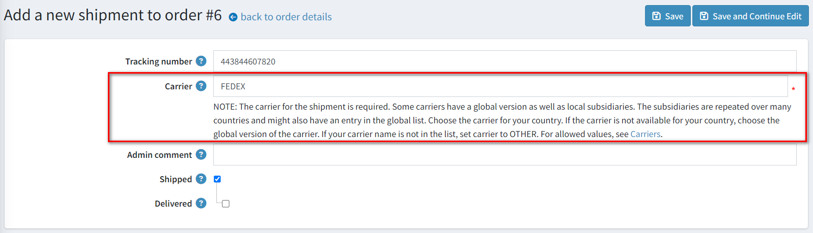

1. 接著前往 *Feature PayPal Prominently*（顯著呈現 PayPal）面板：

    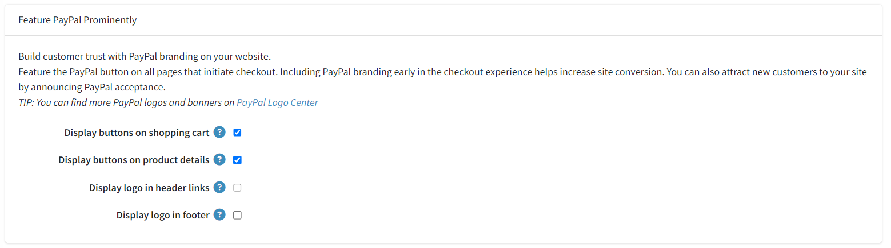
  
    在此面板上，定義顯示設定：

      * 勾選 **在購物車顯示按鈕 (Display buttons on shopping cart)** 核取方塊，以便在購物車頁面上除了預設的結帳按鈕外，額外顯示 PayPal 按鈕。

      * 勾選 **在商品詳細頁面顯示按鈕 (Display buttons on product details)** 核取方塊，以便在商品詳細頁面顯示 PayPal 按鈕，讓買家無需經過完整的結帳流程即可完成購買。

      * 勾選 **在頁首連結中顯示標誌 (Display logo in header links)** 核取方塊，以便在頁首連結中顯示 PayPal 標誌。這些標誌與橫幅是讓買家知道您選擇 PayPal 來安全處理付款的絕佳方式。
        * 如果勾選了上述核取方塊，系統會顯示 **標誌原始碼 (Logo source code)** 欄位。請在此欄位輸入標誌的原始碼。您可以在 PayPal Logo Center 找到更多標誌與橫幅。您也可以修改程式碼以使其更符合您的佈景主題與網站風格。

      * 勾選 **在頁尾顯示標誌 (Display logo in footer)** 核取方塊，以便在頁尾顯示 PayPal 標誌。這些標誌與橫幅是讓買家知道您選擇 PayPal 來安全處理付款的絕佳方式。
        * 如果勾選了上述核取方塊，系統會顯示 **標誌原始碼 (Logo source code)** 欄位。請在此欄位輸入標誌的原始碼。您可以在 PayPal Logo Center 找到更多標誌與橫幅。您也可以修改程式碼以使其更符合您的佈景主題與網站風格。

1. 點擊 **儲存** 以儲存外掛設定。

> [!NOTE]
>
> 您不需要啟用該外掛，它在安裝後會立即啟用。如果基於某些原因您不打算在商店中使用它，可以在 **設定 → 本地外掛** 頁面中將其停用。

### 3. 設定 PayPal Pay Later 訊息

PayPal 提供短期、無息付款以及其他特殊的融資選項，讓買家可以先買後付，而賣家則能立即收到款項。Pay Later 優惠會因國家/地區而異。透過 Pay Later 優惠，賣家可以為購物者提供更強的購買力，以及將購物成本分攤到一段時間內支付的靈活性。
有關 Pay Later 的更多資訊，請參閱 [先買後付](https://www.paypal.com/digital-wallet/ways-to-pay/buy-now-pay-later)。

1. 點擊 **設定 → PayPal Commerce** 選單項目上的 **Pay Later** 連結，您將會看到以下設定介面：

    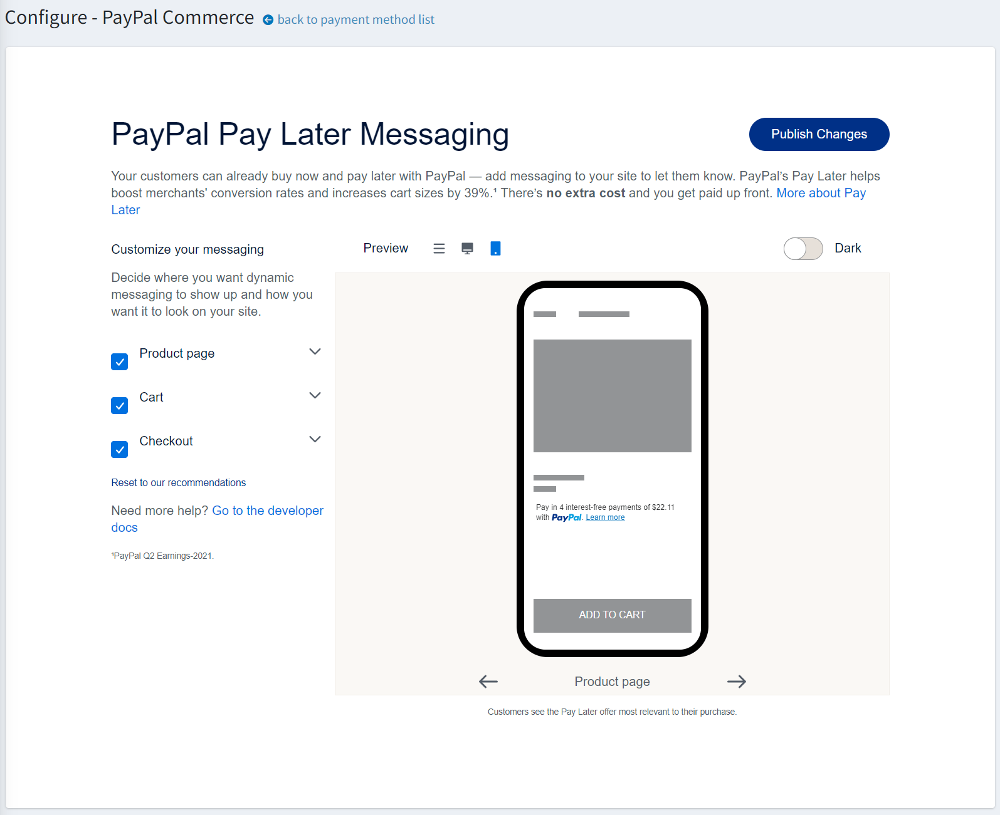

    在這裡，您可以自訂您的 Pay Later 訊息。

1. 點擊 **Publish Changes** 以儲存設定。

## 限制商店與顧客角色

您可以將任何付款方式限制在特定的商店與顧客角色。這代表該方式將僅對特定的商店或顧客角色開放。您可以在 *外掛清單* 頁面進行此設定。

1. 前往 **組態 → 本地外掛**。找到您想要限制的外掛。以我們的案例來說，它是 **PayPal Commerce**。若要更快找到它，請使用頁面頂端的 *搜尋* 面板，並透過 *付款方式* 選項，以 **外掛名稱** 或 **群組** 進行搜尋。

    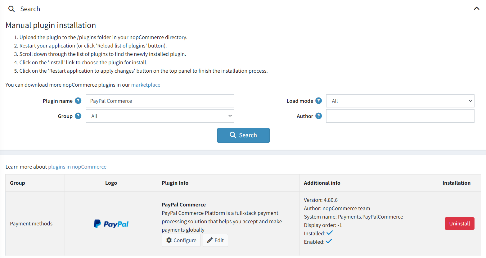

1. 點擊 **編輯** 按鈕，*編輯外掛詳細資料* 視窗將顯示如下：

    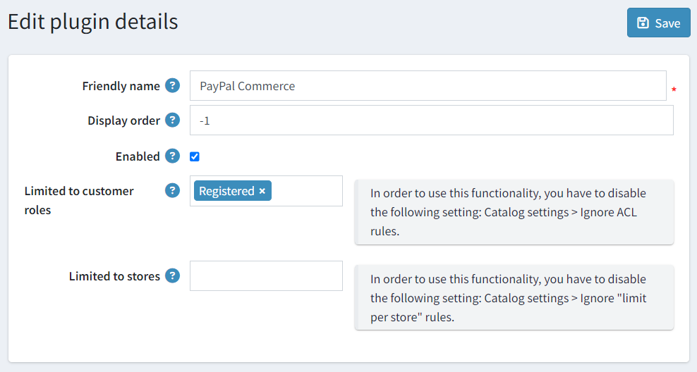

1. 您可以設定以下限制：

    * 在 **限制顧客角色** 欄位中，選擇一個或多個能夠使用此外掛的顧客角色（例如：管理員、供應商、訪客）。如果您不需要此選項，只需將此欄位留空即可。

        > [!Important]
        > 若要使用此功能，您必須停用下列設定：**商品目錄設定 → 忽略 ACL 規則 (全站)**。閱讀更多關於權限控制（ACL）的資訊 [here](xref:zh-Hant/running-your-store/customer-management/access-control-list)。

    * 使用 **限制商店** 選項將此外掛限制在特定商店。如果您有多個商店，請從列表中選擇一個或多個。如果您不需要此選項，只需將此欄位留空即可。

        > [!Important]
        > 若要使用此功能，您必須停用下列設定：**商品目錄設定 → 忽略「各商店限制」規則 (全站)**。閱讀更多關於多商店功能的資訊 [here](xref:zh-Hant/getting-started/advanced-configuration/multi-store)。

1. 點擊 **儲存**。