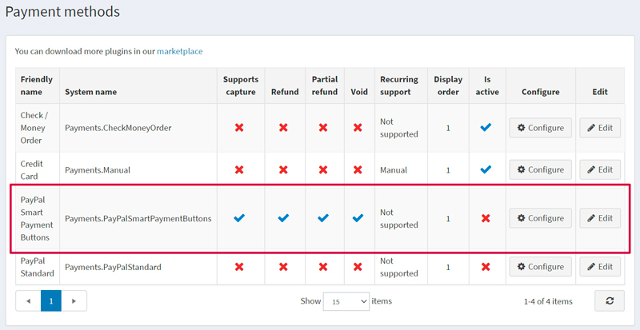
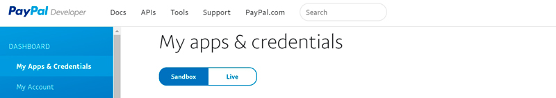
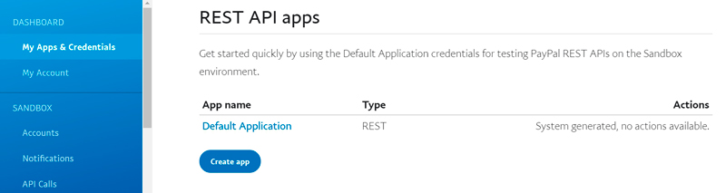
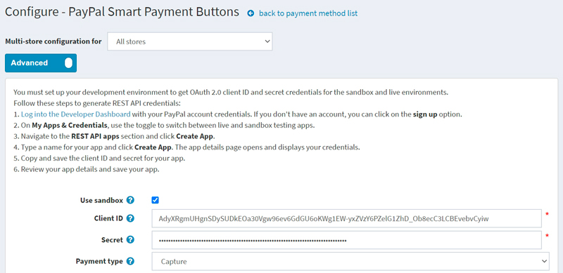
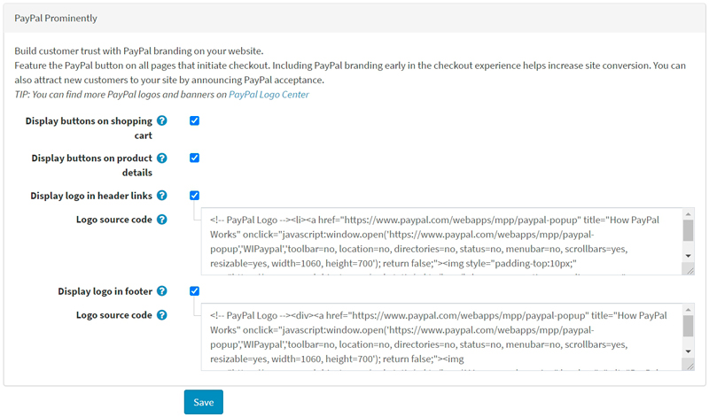
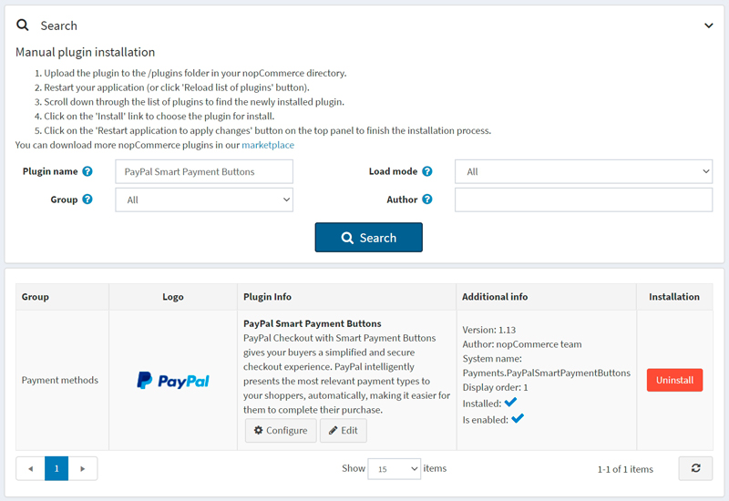
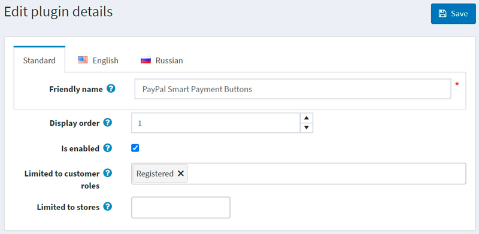

# PayPal Smart Payment Buttons

> [!Important]
>
> 此外掛目前已棄用，並已由 [**PayPal Commerce**](xref:zh-Hant/getting-started/configure-payments/payment-methods/paypal-commerce) 外掛取代。

具備 Smart Payment Buttons 的 PayPal Checkout 能為您的買家提供簡化且安全的結帳體驗。PayPal 會自動智慧地向您的購物者呈現最相關的付款方式，讓他們能更輕鬆地使用 Pay with Venmo、PayPal Credit、信用卡付款、iDEAL、Bancontact、Sofort 以及其他付款方式來完成購買。

## 影片教學

觀看此 [影片教學](https://youtu.be/lJxVqjwUFkY) 以學習如何設定 PayPal 智慧付款按鈕（PayPal Smart Payment Buttons）。

## 設定付款提供程序

若要設定 PayPal Smart Payment Buttons 外掛，請前往 **設定 → 付款提供程序**。接著在付款提供程序清單中找到 **PayPal Smart Payment Buttons**：

請依照下列步驟設定 PayPal Smart Payment Buttons：

### 1. 啟用付款提供程序

若要執行此操作，請在付款方式清單頁面中，點擊該外掛列上的 **編輯 (Edit)** 按鈕。勾選 **啟用 (Is active)** 核取方塊來啟動此外掛，然後點擊 **更新 (Update)** 按鈕，您的變更即會儲存。

### 2. 建立 PayPal 帳戶

如果您已經擁有 PayPal 帳戶，請直接前往 [下一節](#3-set-up-the-paypal-developer-dashboard)。

請在 [PayPal](https://www.paypal.com/us/webapps/mpp/referral/paypal-business-account2?partner_id=9JJPJNNPQ7PZ8) 註冊一個企業帳戶。接著填寫關於您個人及企業的相關資訊：

> [!NOTE]
>
> 如果您已經擁有帳戶，系統將會引導您進行授權。

### 3. 設定 PayPal 開發者後台 (Developer Dashboard)

1. 使用您的 PayPal 帳號憑證登入 [開發者後台](https://developer.paypal.com/developer/applications)。

1. 在 **My Apps & Credentials** 中，使用切換開關來選擇正式環境 (live) 或沙盒測試環境 (sandbox) 的應用程式。
    
  
1. 前往 *REST API apps* 區塊並點擊 **Create App**。
    

1. 輸入應用程式名稱並點擊 **Create App**。系統將會開啟應用程式詳細資料頁面，並顯示您的憑證。

1. 複製並儲存應用程式的 **Client ID** 與 **Secret**。

1. 檢查您的應用程式詳細資料，若有任何變更，請記得儲存。

### 4. 在 nopCommerce 中設定付款方式

1. 在 **設定 → 付款方式** 頁面中找到 **PayPal Smart Payment Buttons** 付款方式，然後點擊 **設定**。隨即會顯示 *設定 - PayPal Smart Payment Buttons* 頁面，如下所示：
    

1. 在 *設定 - PayPal Smart Payment Buttons* 頁面上定義以下設定：
    * **使用沙盒 (Use sandbox)**：如果您想先測試此付款方式，請勾選此項。
    * 輸入您在先前步驟中儲存的 **用戶端 ID (Client ID)**。
    * 輸入您在先前步驟中儲存的 **密鑰 (Secret)**。
    * 選擇 **付款類型 (Payment type)**，可選擇立即請款或在建立訂單後授權付款。

1. 接著前往 *PayPal 醒目顯示 (PayPal Prominently)* 面板：
    
  
    在此面板上，定義顯示設定：

      * 勾選 **在購物車顯示按鈕 (Display buttons on shopping cart)** 核取方塊，以在購物車頁面上顯示 PayPal 按鈕，取代預設的結帳按鈕。

      * 勾選 **在商品詳細頁顯示按鈕 (Display buttons on product details)** 核取方塊，以在商品詳細頁面上顯示 PayPal 按鈕；點擊這些按鈕的效果與預設的「加入購物車」按鈕行為相同。

      * 勾選 **在頁首連結顯示標誌 (Display logo in header links)** 核取方塊，以在頁首連結中顯示 PayPal 標誌。這些標誌和橫幅是讓買家了解您選擇 PayPal 來安全處理付款的絕佳方式。
        * 如果勾選了上述核取方塊，系統會顯示 **標誌原始碼 (Logo source code)** 欄位。請在此欄位中輸入標誌的原始碼。您可以在 PayPal Logo Center 找到更多標誌和橫幅。您也可以修改程式碼，使其完美融入您的佈景主題與網站風格。

      * 勾選 **在頁尾顯示標誌 (Display logo in footer)** 核取方塊，以在頁尾顯示 PayPal 標誌。這些標誌和橫幅是讓買家了解您選擇 PayPal 來安全處理付款的絕佳方式。
        * 如果勾選了上述核取方塊，系統會顯示 **標誌原始碼 (Logo source code)** 欄位。請在此欄位中輸入標誌的原始碼。您可以在 PayPal Logo Center 找到更多標誌和橫幅。您也可以修改程式碼，使其完美融入您的佈景主題與網站風格。

點擊 **儲存** 以儲存外掛設定。

## 限制商店與顧客角色

您可以將任何付款方式限制在特定的商店與顧客角色中。這表示該付款方式僅對特定的商店或顧客角色開放。您可以從*外掛列表*頁面進行此設定。

1. 前往 **設定 → 本地外掛**。找到您想要限制的外掛。在我們的範例中，它是 **PayPal Smart Payment Buttons**。為了更快速找到它，請使用頁面上方的*搜尋*面板，並透過*付款方式*選項，依**外掛名稱**或**群組**進行搜尋。

    

1. 點擊 **編輯** 按鈕，*編輯外掛詳情*視窗將顯示如下：

    

1. 您可以設定以下限制：

    * 在 **限制顧客角色** 欄位中，選擇一個或多個顧客角色（例如：管理員、供應商、訪客），這些角色將能夠使用此付款外掛。如果您不需要此選項，請將此欄位留空。

        > [!Important]
        >
        > 為了使用此功能，您必須停用以下設定：**目錄設定 → 忽略 ACL 規則 (全站)**。閱讀更多關於權限控制（ACL）的內容 [here](xref:zh-Hant/running-your-store/customer-management/access-control-list)。

    * 使用 **限制商店** 選項將此外掛限制在特定商店。如果您有多個商店，請從列表中選擇一個或多個。如果您不需要此選項，請將此欄位留空。

        > [!Important]
        >
        > 為了使用此功能，您必須停用以下設定：**目錄設定 → 忽略「限制商店」規則 (全站)**。閱讀更多關於多商店功能的內容 [here](xref:zh-Hant/getting-started/advanced-configuration/multi-store)。

    點擊 **儲存**。