# PayPal Standard

> [!Important]
>
> 此外掛目前已棄用，並已由 [**PayPal Commerce**](xref:zh-Hant/getting-started/configure-payments/payment-methods/paypal-commerce) 外掛取代。

PayPal Standard 是在線上安全接收信用卡與 PayPal 付款最簡單的方式。

若要設定 PayPal Standard 外掛，請前往 **設定 → 付款方式**。接著在付款方式列表中找到 **PayPal Standard** 付款方式：

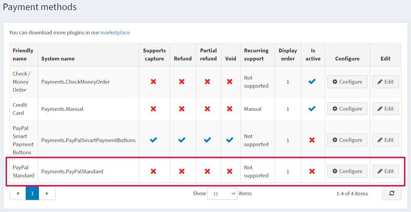

## 啟用付款方式、編輯名稱與顯示順序

您可以編輯付款方式名稱（這將顯示給前台網站的顧客查看）或其顯示順序。若要執行此操作，請在付款方式列表頁面中，點擊該外掛所在列的 **編輯 (Edit)** 按鈕。您可以輸入 **友好名稱 (Friendly name)** 以及 **顯示順序 (Display order)**。在此列中，您也可以透過 **是否啟用 (Is active)** 欄位來啟用或停用該外掛。點擊 **更新 (Update)** 按鈕，您的變更即會儲存。

## 設定付款方式

若要使用 **PayPal Standard** 外掛作為付款方式，請遵循以下步驟：

1. 在 www.paypal.com 註冊一個企業帳戶。請前往連結 [https://www.paypal.com/bizsignup/](https://www.paypal.com/bizsignup/)，並填寫您與您業務的相關資訊：

    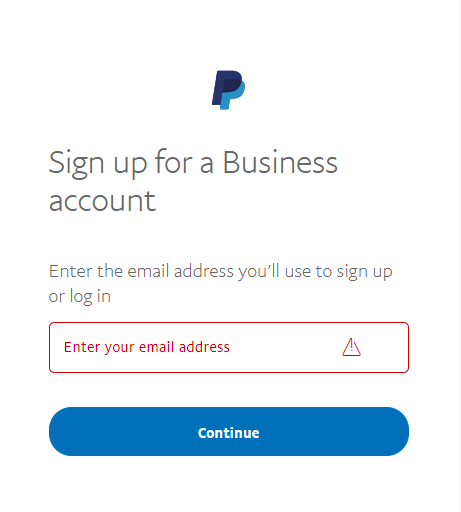

    > [!NOTE]
    >
    > 如果您已經擁有帳戶，系統將會引導您進行授權。

    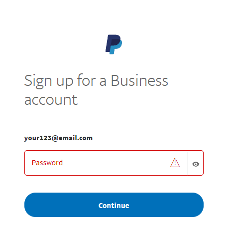

    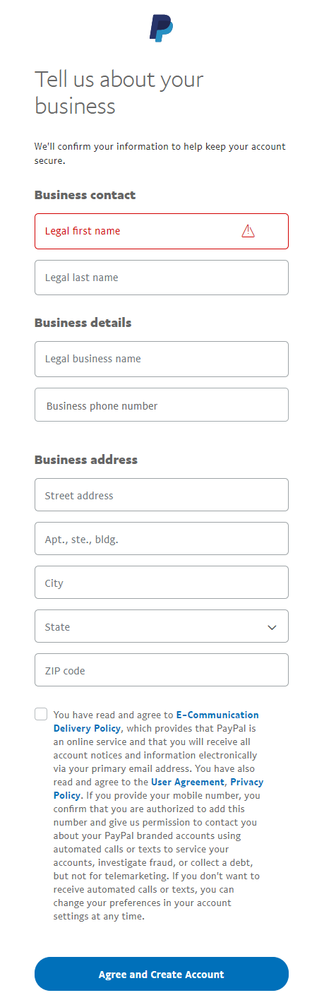

    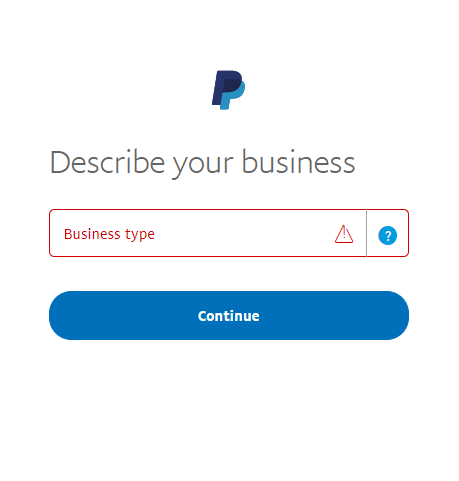

    

1. 在頂部導覽列中，點擊 **設定 (Settings)** 圖示 。

1. 在左側面板中選擇 **網站付款 (Website payments)**，並在 **網站偏好設定 (Website preferences)** 行中點擊 **更新 (Update)**。

    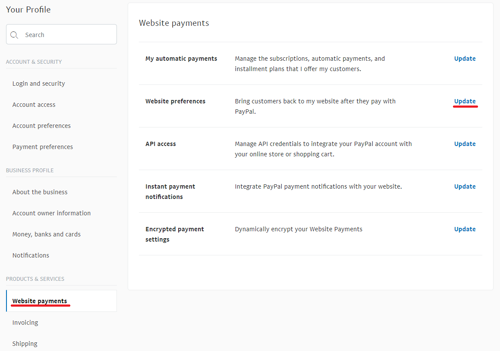

1. 在 **網站付款自動返回 (Auto return for website payments)** 區段中，將開關切換為 **開啟 (On)**。在 **返回網址 (Return URL)** 中，輸入您網站的網址；當顧客完成付款後，PayPal 會將交易識別碼傳送到此網址。以我們的範例來說，網址為 `http://localhost:15536/Plugins/PaymentPayPalStandard/PDTHandler`，但請務必將 localhost 取代為您實際的網站網址。

    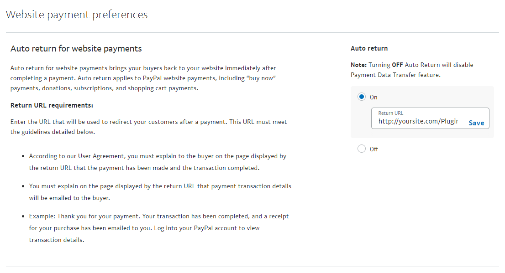

1. 在 **付款資料傳輸 (Payment data transfer)** 區段中，將開關切換為 **開啟 (On)** 並複製 **識別權杖 (Identity Token)**。

    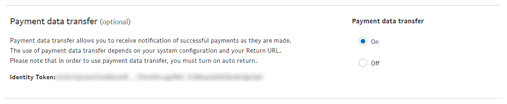

1. 若要在 nopCommerce 的後台管理設定此模組，請前往 **組態 (Configuration) → 付款方式 (Payment methods)**。在 **PayPal Standard** 這一行，點擊 **設定 (Configure)**。

   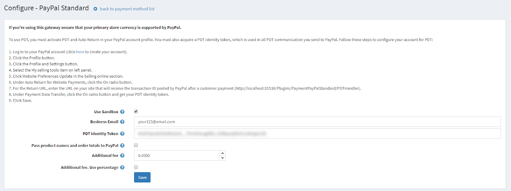

1. 在 **企業信箱 (Business Email)** 欄位中，輸入您在 paypal.com 註冊企業帳戶時所指定的電子郵件。

1. 在 **PDT 識別權杖 (PDT Identity Token)** 欄位中，貼上您在第 5 點複製的 **識別權杖 (Identity Token)**。

1. 點擊 **儲存 (Save)**。

關於 **IPN**（即時付款通知）的啟用：

1. 在左側面板選擇 **通知 (Notifications)**，並點擊 **即時付款通知 (Instant payment notifications)** 行中的 **更新 (Update)**。

   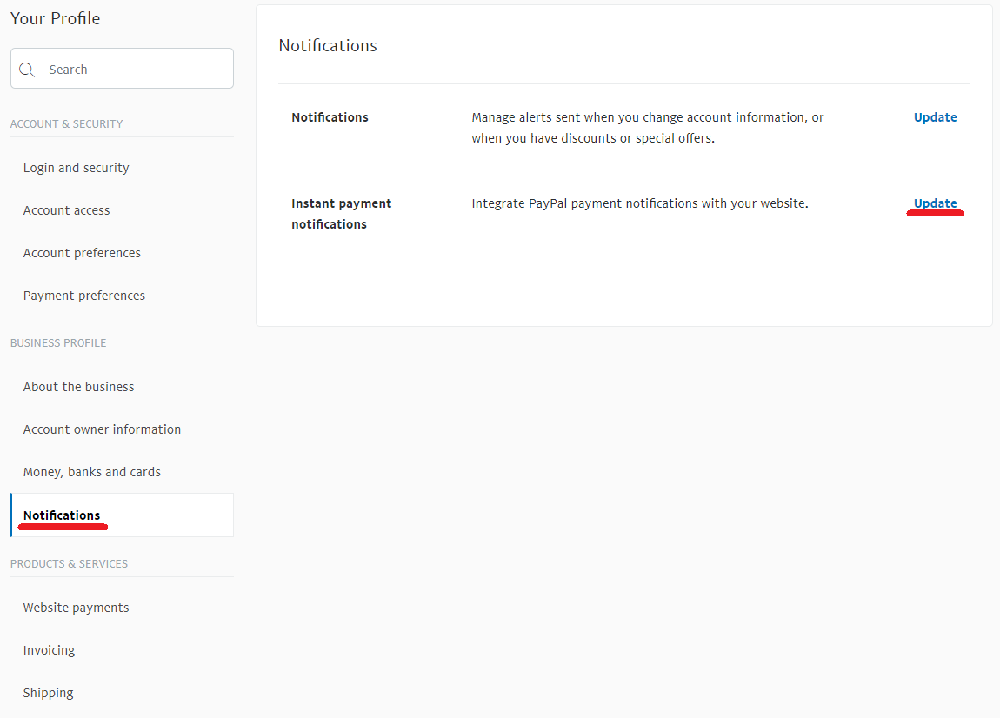

1. 閱讀關於 **IPN** 的資訊，然後點擊 **選擇 IPN 設定 (Choose IPN Settings)**。

   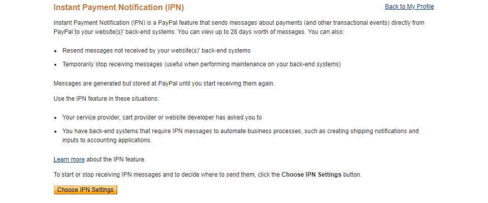

1. 選擇 **接收 IPN 訊息 (Enabled)**。在 **通知網址 (Notification URL)** 中，輸入您的 IPN 處理器網址。

   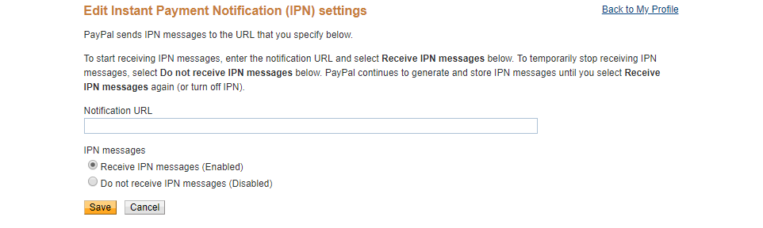

1. 點擊 **儲存 (Save)**。您應該會收到一則訊息，確認您已成功啟用 IPN。

> [!NOTE]
>
> 即時付款通知 (IPN) 是一項 PayPal 訊息服務，可在交易受影響時發送通知。一旦整合了 IPN，賣家即可自動化其後勤作業，無需等待付款入帳即可觸發訂單履行流程。

## 限制商店與顧客角色

您可以將任何付款方式限制在特定的商店與顧客角色中使用。這代表該方式僅會提供給特定的商店或顧客角色。您可以在 *外掛清單* 頁面中進行此設定。

1. 前往 **設定 → 本地外掛**。找到您想要限制的外掛。在本範例中為 **PayPal Standard**。若要更快速地找到它，請使用頁面頂端的 *搜尋* 面板，並利用 *付款方式* 選項透過 **外掛名稱** 或 **群組** 進行搜尋。

   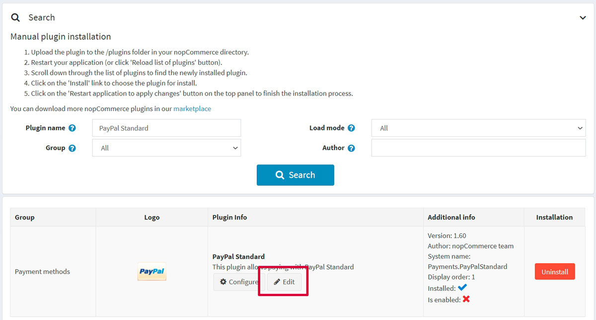

1. 點擊 **編輯** 按鈕，*編輯外掛詳細資料* 視窗將顯示如下：

   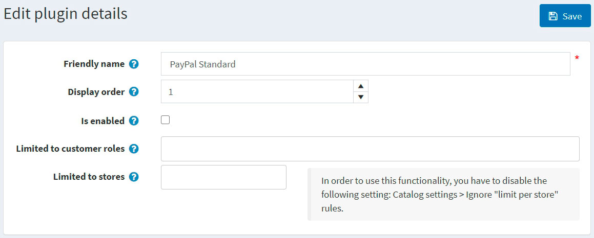

1. 您可以設定以下限制：

   - 在 **限制於顧客角色** 欄位中，選擇一個或多個能夠使用此外掛的顧客角色，例如系統管理員、供應商或訪客。如果您不需要此選項，請將此欄位留空。

     > [!IMPORTANT]
     >
     > 為了使用此功能，您必須停用下列設定：**目錄設定 → 忽略權限控制規則 (全站)**。閱讀更多關於權限控制（ACL）的資訊 [here](xref:zh-Hant/running-your-store/customer-management/access-control-list)。

   - 使用 **限制於商店** 選項，將此外掛限制在特定商店中使用。如果您有多商店環境，請從清單中選擇一個或多個商店。如果您不使用此選項，請將此欄位留空。

     > [!IMPORTANT]
     >
     > 為了使用此功能，您必須停用下列設定：**目錄設定 → 忽略「限制於商店」規則 (全站)**。閱讀更多關於多商店功能的資訊 [here](xref:zh-Hant/getting-started/advanced-configuration/multi-store)。

   - 點擊 **儲存**。

## 已知問題

### 錯誤：目前似乎無法運作 (PayPal)

如果您看到錯誤訊息「Things don't appear to be working at the moment. Please try again later」（目前似乎無法運作。請稍後再試）

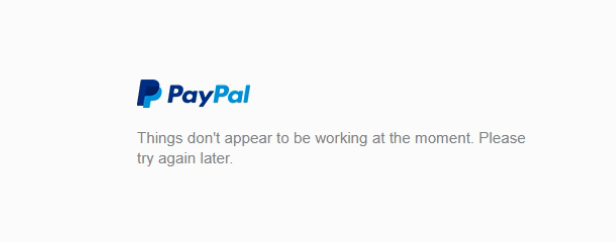

此錯誤是由您 PayPal 帳戶內的設定所引起的。

**步驟 1**：在左側邊欄的「產品與服務」(Products & Services) 下方，點擊「網站付款」(Website Payments)

**步驟 2**：點擊「網站偏好設定」(Website Preferences) 區塊旁邊的「更新」(Update)

**步驟 3**：向下捲動至「加密網站付款」(Encrypted Website Payments) 區塊，在右側選擇「關閉」(Off)，然後儲存您的變更。

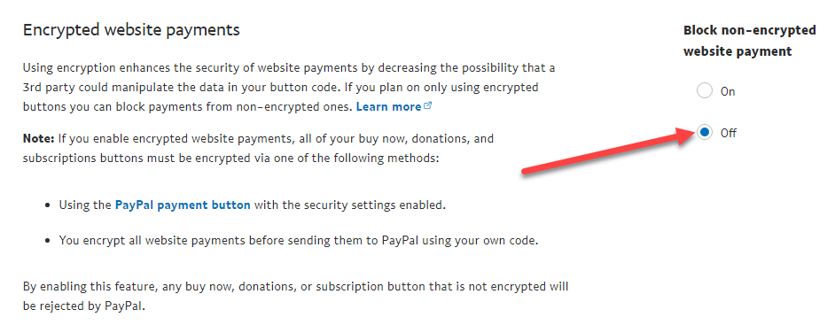

儲存變更後，您可以回到您的網站並再次嘗試按鈕/表單，它們應該就能正常運作了。