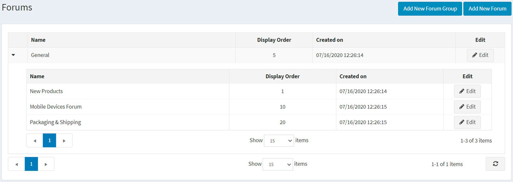
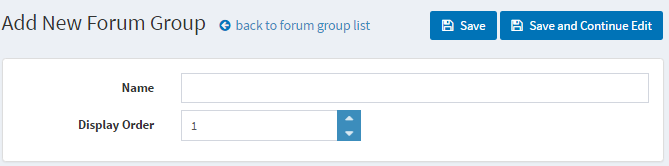
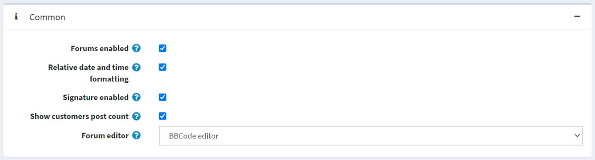
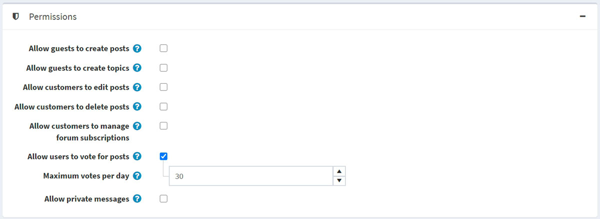

# 論壇

論壇是一個線上討論網站，人們可以透過發佈訊息的方式進行對話。一個論壇可能包含多個子論壇，每個子論壇都有數個主題。

> [!NOTE]
>
> 在 nopCommerce 中，論壇預設是停用的。要啟用論壇，請前往 **組態 (Configuration) → 設定 (Settings) → 論壇設定 (Forum settings)** 並勾選 **論壇已啟用 (Forums enabled)** 核取方塊。「論壇」連結應會顯示在前台網站的選單中（預設佈景主題的頂部選單或頁尾）。

若要管理論壇群組和論壇（位於論壇群組內），請前往 **內容管理 (Content management) → 論壇 (Forums)**。

## 新增論壇群組

按一下 **新增論壇群組 (Add new forum group)** 按鈕。

- 定義新論壇群組的 **名稱 (Name)**。
- 在 **顯示順序 (Display order)** 欄位中，輸入論壇群組的顯示順序。數值 1 代表清單的最上方。

按一下 **儲存 (Save)**。

## 新增論壇

- 從 **論壇群組 (Forum group)** 下拉選單中，選擇所需的論壇群組。
- 輸入新論壇的 **名稱 (Name)**。
- 輸入新論壇的 **描述 (Description)**。
- 選擇論壇的 **顯示順序 (Display order)**。數值 1 代表清單的最上方。

按一下 **儲存 (Save)**。

若要查看論壇運作方式的範例，請前往 <http://www.nopcommerce.com/boards/>。

## 論壇設定

若要存取論壇設定，請前往 **組態 (Configuration) → 設定 (Settings) → 論壇設定 (Forum settings)**。此頁面提供 2 種模式：*進階 (advanced)* 和 *基礎 (basic)*。

此頁面支援多商店組態；這意味著可以為所有商店定義相同的設定，或者根據商店而有所不同。如果您想管理特定商店的設定，請從多商店組態下拉選單中選擇其名稱，並勾選左側所有需要的核取方塊以設定自定義值。如需進一步詳情，請參閱 [多商店 (Multi-store)](xref:zh-Hant/getting-started/advanced-configuration/multi-store)。

### 一般 (Common)

在 *一般 (Common)* 面板中定義以下論壇設定：

- 透過勾選 **論壇已啟用 (Forums enabled)** 核取方塊來啟用論壇。
- 勾選 **相對日期與時間格式 (Relative date and time formatting)** 核取方塊以啟用相對日期與時間（例如：2 小時前、1 天前）。
- 您可以透過勾選 **簽名已啟用 (Signature enabled)** 來讓顧客指定簽名。
- 勾選 **顯示顧客發佈數量 (Show customers post count)** 核取方塊以啟用顯示顧客建立的發佈數量。
- 從 **論壇編輯器 (Forum editor)** 下拉選單中，選擇要使用的論壇編輯器類型：
  - 簡單文字框 (Simple textbox)。
  - BBCode 編輯器 (BBCode editor)。
  > [!NOTE]
  >
  > 不建議在正式環境中更改論壇編輯器類型。

### 權限 (Permissions)

在 *權限 (Permissions)* 面板中定義以下論壇設定：

- **允許訪客建立發佈 (Allow guests to create posts)**。
- **允許訪客建立主題 (Allow guests to create topics)**。
- **允許顧客編輯發佈 (Allow customers to edit posts)**。
- **允許顧客刪除發佈 (Allow customers to delete posts)**。
- **允許顧客管理論壇訂閱 (Allow customers to manage forum subscriptions)**。
- 勾選 **允許使用者對發佈投票 (Allow users to vote for posts)** 核取方塊以啟用投票功能。
  - 如果啟用了前述設定，**每日最大投票數 (Maximum votes per day)** 欄位可設定使用者每天可以投票的次數。
- 透過勾選 **允許私訊 (Allow private messages)** 核取方塊來啟用私訊功能。如果啟用，將顯示以下兩個設定：
  - 勾選 **顯示私訊警示 (Show alert for PM)** 核取方塊，以便在收到新私訊時啟用警示彈出視窗。
  - 如果顧客應透過電子郵件收到新私訊通知，請勾選 **通知私訊 (Notify about private messages)**。

### 分頁大小 (Page sizes)

在 *分頁大小 (Page sizes)* 面板中定義以下論壇設定：

- **主題分頁大小 (Topics page size)** — 論壇中主題的分頁大小，例如每頁 '10' 個主題。
- **發佈分頁大小 (Posts page size)** — 主題中發佈內容的分頁大小，例如每頁 '10' 則發佈。
- **搜尋結果分頁大小 (Search results page size)** — 搜尋結果的分頁大小，例如每頁 '10' 筆結果。
- **活躍討論分頁大小 (Active discussions page size)** – 活躍討論頁面的分頁大小，例如每頁 '10' 筆結果。

### 饋送 (Feeds)

在 *饋送 (Feeds)* 面板中定義以下論壇設定：

- 勾選 **論壇饋送已啟用 (Forum feeds enabled)** 核取方塊以針對每個論壇啟用 RSS 饋送。
- 在 **論壇饋送數量 (Forum feed count)** 欄位中，設定每個饋送中應包含的主題數量。
- 勾選 **活躍討論饋送已啟用 (Active discussions feed enabled)** 核取方塊以針對活躍討論主題啟用 RSS 饋送。
- 在 **活躍討論饋送數量 (Active discussions feed count)** 欄位中，設定「活躍討論」饋送中應包含的討論數量。

## 教學課程

- [在 nopCommerce 中管理論壇](https://www.youtube.com/watch?v=wW2QvC4WA_8)